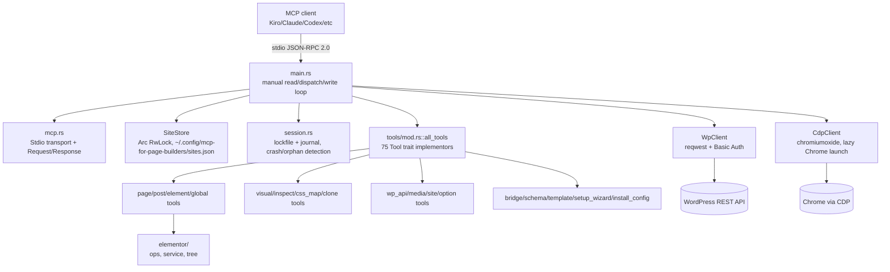

# System architecture

## Panic isolation (deliberate, verified in main.rs)

Each tool call is wrapped in `catch_unwind` — a single bad/panicking tool call cannot kill the whole server process. Combined with the most recent commit's fix (stdin robustness against blank/malformed lines + file logging), this reads as a codebase that has been deliberately hardened against exactly the failure modes that would silently break an MCP server mid-session for a client that can't easily tell the difference between "no response" and "crashed."

## Runtime reconfiguration without restart (verified in main.rs + wp.rs)

`connect_site`/`switch_site` tools mutate the shared `SiteStore` then send a `ServerNotification::Reconfigure` over an mpsc channel; the main loop drains it and calls `wp.reconfigure(creds)`, rebuilding the reqwest client/auth header/base_url **in place** — the MCP client never sees a restart or a stale-connection error. See [[multi-site-credential-store-design]].

## Chrome/CDP process isolation (verified, most recent commit)

Each server instance launches Chrome into a **PID-scoped** temp profile directory (`mcp-for-page-builders-cdp-<pid>`), not a shared fixed path — this fixed a real bug where one server instance's cleanup logic would `pkill` another concurrently-running instance's live Chrome process. Stale profile dirs from dead PIDs are swept on launch (liveness checked via `kill -0` before touching anything). Bounded timeouts (30s launch, 20s navigation) prevent a hung Chrome from freezing the MCP client indefinitely.

## Module organization: "single-struct-per-file" (per commit `a149991`/`c3d957e`)

`types/` is split into `tool.rs`, `tool_def.rs`, `tool_result.rs`, `request.rs`, `response.rs`, `element.rs` — one struct/concept per file, a deliberate refactor away from a monolithic types module. `tools/` mirrors this at the domain level (one file/subdir per tool category).

See [[mcp-bridge-plugin-purpose]] for the WordPress-side companion component.
