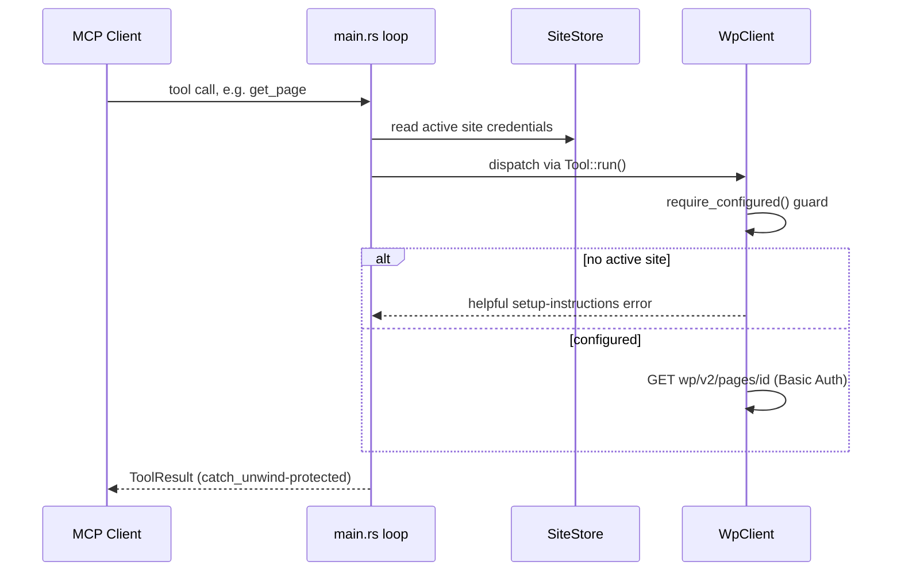
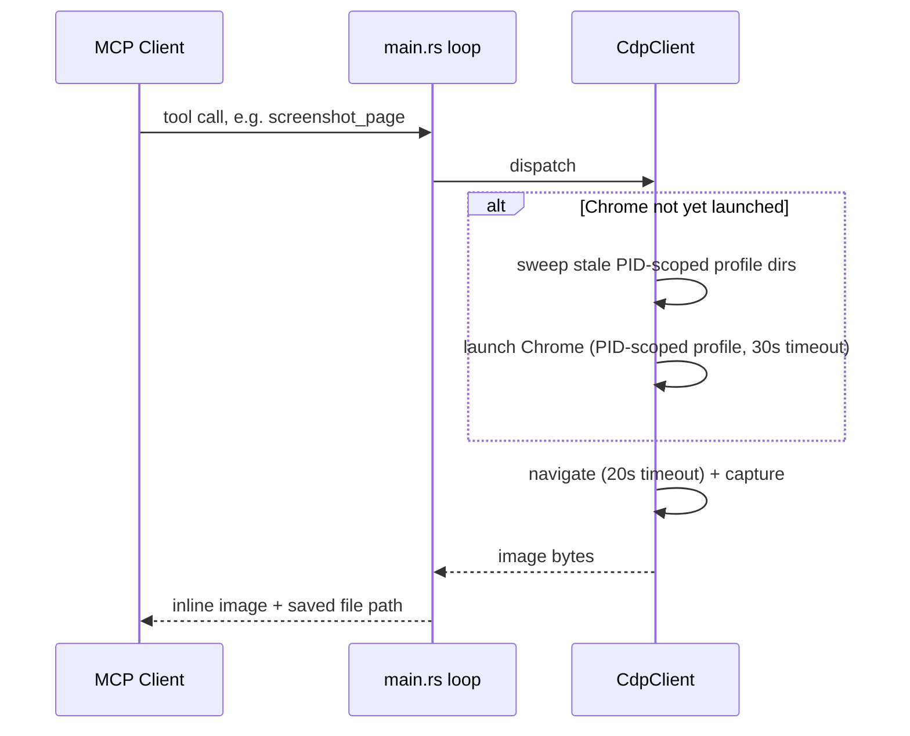
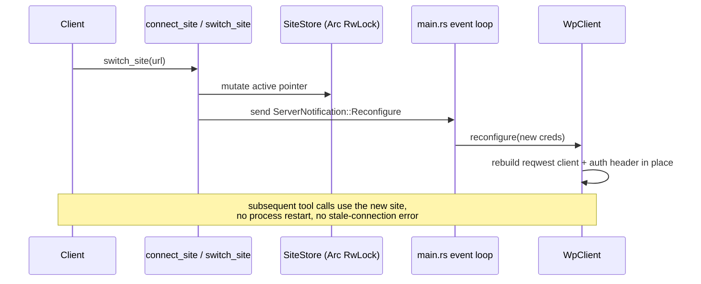

# Key flows

---
slug: flow
title: Key flows
role: key flows
updated: "2026-07-23T13:53:36"
---

# Key flows

Two representative flows: a WordPress REST call, and a CDP-based visual tool.

## Site-switching flow (no restart)

