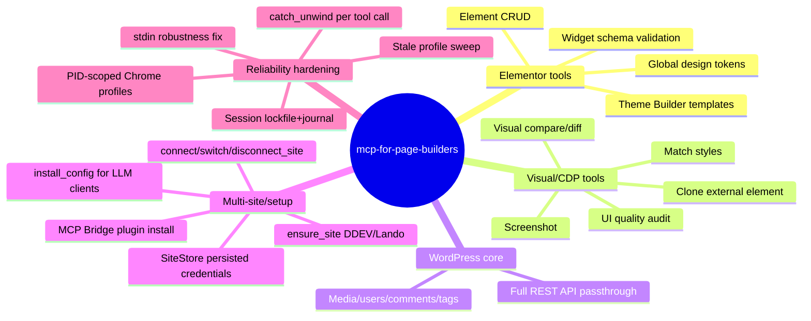

# Feature mindmap

---
slug: mindmap
title: Feature mindmap
role: feature mindmap
updated: "2026-07-23T13:53:53"
---

# Feature mindmap

See architecture for the technical detail behind each branch.
